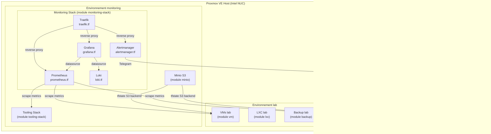

# PVE Home - Infrastructure Proxmox Homelab

[](https://github.com/christopherlouet/pve-home/actions/workflows/ci.yml)
[](https://github.com/christopherlouet/pve-home/actions/workflows/codeql.yml)
[](https://www.terraform.io/)
[](LICENSE)

Infrastructure as Code pour gérer un homelab Proxmox VE sur Intel NUC avec Terraform.

## Fonctionnalités

- **VMs avec cloud-init** : Provisionnement automatique avec Docker pré-installé
- **Conteneurs LXC** : Support des conteneurs légers avec option nesting
- **Sauvegardes automatiques** : Vzdump quotidien/hebdomadaire avec rétention configurable par environnement
- **State Terraform sécurisé** : Backend S3 Minio avec versioning pour récupération en cas d'erreur
- **Stack Monitoring** : Prometheus, Grafana, Alertmanager, Traefik, Loki, Uptime Kuma sur PVE dédié avec dashboards et alertes
- **Stack Tooling** : PKI interne (Step-ca), Registre Docker (Harbor), SSO (Authentik) avec reverse proxy Traefik
- **Scripts de restauration** : Restauration automatisée de VMs, state Terraform et composants critiques
- **Modules réutilisables** : Modules Terraform pour VM, LXC, backup, Minio, monitoring et tooling
- **Détection de drift** : Vérification automatique des dérives Terraform avec métriques Prometheus
- **Health checks** : Surveillance de la santé des VMs, monitoring et Minio (SSH automatise via keypair dediee)
- **Deploiement monitoring** : Script `deploy.sh` pour provisionner scripts, tfvars et timers systemd sur la VM monitoring
- **Cycle de vie VMs** : Snapshots, expiration automatique, mises à jour de sécurité, rotation SSH
- **Tests Terraform natifs** : Validation, plan et non-regression des 6 modules avec `terraform test` et `mock_provider`
- **Resilience SSH** : Retry avec backoff exponentiel pour les connexions SSH dans les scripts d'operation
- **CI/CD** : Validation Terraform, tests, et scans de sécurité via GitHub Actions
- **TUI interactif** : Interface terminal pour gérer l'infrastructure (status, terraform, snapshots, services)

## Prérequis

- [Proxmox VE 8.x ou 9.x](https://www.proxmox.com/) installé
- [Terraform >= 1.9](https://www.terraform.io/)
- Template VM cloud-init (Ubuntu) créé sur Proxmox
- Token API Proxmox avec les permissions appropriées

## Structure du projet

```
pve-home/
├── infrastructure/proxmox/
│   ├── versions.tf              # Versions de reference (provider + Terraform)
│   ├── _shared/                 # Templates de configuration reutilisables
│   ├── modules/
│   │   ├── vm/                  # Module VM avec cloud-init et Docker
│   │   │   └── tests/           # Tests natifs Terraform
│   │   ├── lxc/                 # Module conteneur LXC
│   │   │   └── tests/           # Tests natifs Terraform
│   │   ├── backup/              # Module sauvegardes vzdump
│   │   │   └── tests/           # Tests natifs Terraform
│   │   ├── minio/               # Module Minio S3 (backend Terraform)
│   │   │   └── tests/           # Tests natifs Terraform
│   │   ├── monitoring-stack/    # Stack Prometheus/Grafana/Alertmanager
│   │   │   └── tests/           # Tests natifs Terraform
│   │   └── tooling-stack/       # Stack PKI/Registry/SSO (Step-ca, Harbor, Authentik)
│   │       └── tests/           # Tests natifs Terraform
│   └── environments/
│       ├── prod/                # PVE production (workloads)
│       ├── lab/                 # PVE lab/test (workloads)
│       └── monitoring/          # PVE dedie monitoring
├── docs/
│   ├── INSTALLATION-PROXMOX.md
│   ├── PKI-INSTALLATION.md
│   ├── ARCHITECTURE.md
│   ├── BACKUP-RESTORE.md
│   ├── DISASTER-RECOVERY.md
│   ├── DRIFT-DETECTION.md
│   ├── HEALTH-CHECKS.md
│   ├── ALERTING.md
│   ├── VM-LIFECYCLE.md
│   ├── TOOLING-STACK.md
│   └── troubleshooting/        # Guides de depannage (e1000e, etc.)
├── scripts/
│   ├── homelab                  # Point d'entree TUI principal
│   ├── lib/                     # Bibliotheques (common.sh + tui/)
│   ├── menus/                   # Modules de menu TUI (8 menus)
│   ├── restore/                 # Scripts de restauration
│   ├── drift/                   # Detection de drift Terraform
│   ├── health/                  # Health checks infrastructure
│   ├── lifecycle/               # Cycle de vie VMs/LXC (snapshots, expiration, SSH)
│   ├── tooling/                 # Scripts tooling (SSO, PKI, Harbor)
│   └── systemd/                 # Timers et services systemd
├── tests/                       # Tests BATS pour les scripts
│   ├── tui/                     # Tests interface TUI (439 tests)
│   ├── restore/
│   ├── scripts/
│   ├── lifecycle/
│   ├── health/
│   └── drift/
└── .github/workflows/           # CI/CD + Security + Terraform Tests
```

## Architecture



## Architecture réseau


## Démarrage rapide

```bash
cd infrastructure/proxmox/environments/prod

# Copier et configurer les variables
cp terraform.tfvars.example terraform.tfvars
vim terraform.tfvars

# Initialiser et déployer
terraform init
terraform plan
terraform apply
```

## Documentation

| Document | Description |
|----------|-------------|
| [Onboarding](docs/ONBOARDING.md) | Guide de decouverte du projet en 30 minutes |
| [Installation Proxmox](docs/INSTALLATION-PROXMOX.md) | Guide d'installation complet de Proxmox VE |
| [Infrastructure README](infrastructure/proxmox/README.md) | Documentation Terraform détaillée (modules, environnements, tests) |
| [Sauvegarde & Restauration](docs/BACKUP-RESTORE.md) | Procédures manuelles et automatisées pour restaurer VMs, state Terraform et composants |
| [Disaster Recovery](docs/DISASTER-RECOVERY.md) | Runbook pas-à-pas pour reconstruction complète après défaillance majeure |
| [Détection de drift](docs/DRIFT-DETECTION.md) | Détection automatique des dérives Terraform avec métriques Prometheus |
| [Health Checks](docs/HEALTH-CHECKS.md) | Vérification de santé de l'infrastructure (VMs, monitoring, Minio) |
| [Alertes Telegram](docs/ALERTING.md) | Configuration des notifications Telegram (création bot, chat_id, troubleshooting) |
| [Cycle de vie VMs](docs/VM-LIFECYCLE.md) | Snapshots, expiration, mises à jour de sécurité, rotation SSH |
| [Stack Tooling](docs/TOOLING-STACK.md) | PKI Step-ca, Registry Harbor, SSO Authentik avec Traefik |
| [Installation PKI](docs/PKI-INSTALLATION.md) | Guide d'installation de l'infrastructure PKI Step-ca |
| [Architecture](docs/ARCHITECTURE.md) | Diagrammes d'architecture Mermaid du projet |
| [ADRs](docs/adr/) | Architecture Decision Records (6 decisions documentees) |
| [Troubleshooting](docs/troubleshooting/) | Guides de depannage (e1000e hardware hang, etc.) |
| [Index des scripts](scripts/README.md) | Index complet de tous les scripts d'opération |

## Exemple de configuration

```hcl
# VM avec Docker et monitoring activé
"docker-server" = {
  ip            = "192.168.1.20"
  cores         = 4
  memory        = 4096
  disk          = 50
  docker        = true
  node_exporter = true  # Expose les métriques pour Prometheus
  tags          = ["docker", "server", "monitored"]
}

# Conteneur LXC léger
"nginx" = {
  ip      = "192.168.1.30"
  cores   = 1
  memory  = 512
  disk    = 8
  nesting = false
  tags    = ["proxy"]
}
```

## Sauvegardes et Restauration

L'infrastructure supporte des sauvegardes automatiques de toutes les VMs et conteneurs via **vzdump** natif Proxmox, avec versioning du state Terraform via **Minio S3**.

### Architecture des sauvegardes

```
PVE Prod (192.168.1.100)  ──┐     ┌─────────────────────┐
  VMs/LXC                  ├─→ vzdump quotidien       │
                           │   (storage local)        │
PVE Mon (192.168.1.50)    ──┤                         │
  Monitoring + Minio      │   ┌─────────────────────┐│
                           │   │ Minio S3 (LXC)      ││
                           └──→│ tfstate buckets     ││
                               │ (versioning actif)  ││
                               └─────────────────────┘│
```

### Politique de rétention par environnement

| Environnement | Schedule | Rétention | Storage |
|---------------|----------|-----------|---------|
| **prod** | Quotidien 01:00 | 7 daily, 4 weekly | local |
| **lab** | Dimanche 03:00 | 3 weekly | local |
| **monitoring** | Quotidien 02:00 | 7 daily | local |

Pour les procédures de restauration détaillées et les scripts automatisés, voir [docs/BACKUP-RESTORE.md](docs/BACKUP-RESTORE.md) et [docs/DISASTER-RECOVERY.md](docs/DISASTER-RECOVERY.md).

## Monitoring & Alertes

Le monitoring est déployé sur un **PVE dédié** (`environments/monitoring/`) et supervise tous les autres PVE :

- **Prometheus** : Collecte des métriques (nodes, VMs, LXC, Proxmox, sauvegardes)
- **Grafana** : Visualisation avec dashboards auto-provisionnés
- **Alertmanager** : Notifications via Telegram
- **PVE Exporter** : Métriques spécifiques Proxmox (un module par node)
- **Node Exporter** : Métriques système (CPU, RAM, disque, réseau) sur la VM et les hosts PVE

```
PVE Prod (192.168.1.100)  ──┐
                            ├── scrape ──> PVE Monitoring (192.168.1.50)
PVE Mon  (192.168.1.50)   ──┘              └─ Prometheus + Grafana + Alertmanager
```

### Dashboards Grafana

14 dashboards sont auto-provisionnés et organisés en 4 dossiers :

#### Infrastructure
| Dashboard | Description |
|-----------|-------------|
| **Nodes Overview** | Vue d'ensemble de tous les noeuds (CPU, RAM, Disk, Network) |
| **Node Exporter** | Métriques détaillées par noeud (CPU, disque, réseau) |
| **PVE Exporter** | VMs, LXC, stockage, statut par node Proxmox |
| **Prometheus** | Self-monitoring (targets, règles, samples) |

#### Observability
| Dashboard | Description |
|-----------|-------------|
| **Alerting Overview** | Vue d'ensemble des alertes actives et historique |
| **Backup Overview** | Supervision des sauvegardes (espace, alertes, statut) |
| **Logs Overview** | Exploration des logs centralisés (si Loki activé) |

#### Applications
| Dashboard | Description |
|-----------|-------------|
| **Application Overview** | Vue d'ensemble par application avec drill-down |
| **HTTP Probes** | Métriques blackbox exporter (latence, SSL, succès) |
| **PostgreSQL** | Métriques base de données (connexions, transactions, cache) |
| **Docker Containers** | Métriques cAdvisor (CPU, mémoire, I/O conteneurs) |

#### Tooling
| Dashboard | Description |
|-----------|-------------|
| **Step-ca** | PKI interne (certificats, ACME, erreurs de signature) |
| **Harbor** | Registre Docker (stockage, vulnérabilités, composants) |
| **Authentik** | SSO (logins, flows, outposts, workers) |

Les dashboards sont stockés dans `infrastructure/proxmox/modules/monitoring-stack/files/grafana/dashboards/` et déployés via le provisioning Grafana. Les dashboards Applications utilisent les variables `$app` et `$environment` pour filtrer par application.

### Alertes Prometheus

53 alertes reparties en 11 groupes supervisent l'infrastructure :

#### Node alerts (9)

| Alerte | Sévérité | Description |
|--------|----------|-------------|
| `HostDown` | Critical | Host injoignable depuis > 2 min |
| `HighCpuUsage` | Warning | CPU > 85% depuis 5 min |
| `HighMemoryUsage` | Warning | RAM > 85% depuis 5 min |
| `HighDiskUsage` | Warning | Disque > 85% depuis 5 min |
| `DiskAlmostFull` | Critical | Disque > 95% depuis 1 min |
| `NodeFilesystemAlmostOutOfInodes` | Warning | Inodes > 90% depuis 5 min |
| `SystemdServiceFailed` | Warning | Service systemd en echec depuis 5 min |
| `HighLoadAverage` | Warning | Load average (15m) > 2x le nombre de CPUs depuis 10 min |
| `HighNetworkErrors` | Warning | Erreurs reseau > 10/s depuis 5 min |

#### Proxmox alerts (5)

| Alerte | Sévérité | Description |
|--------|----------|-------------|
| `ProxmoxNodeDown` | Critical | Node Proxmox injoignable depuis > 2 min |
| `ProxmoxVMStopped` | Warning | VM arretee depuis > 10 min |
| `ProxmoxHighCpuUsage` | Warning | CPU Proxmox > 90% depuis 10 min |
| `ProxmoxHighMemoryUsage` | Warning | RAM Proxmox > 90% depuis 10 min |
| `ProxmoxStorageAlmostFull` | Warning | Stockage Proxmox > 85% depuis 5 min |

#### Prometheus alerts (3)

| Alerte | Sévérité | Description |
|--------|----------|-------------|
| `PrometheusTargetMissing` | Warning | Target down depuis 5 min |
| `PrometheusConfigReloadFailed` | Critical | Echec du rechargement de la config Prometheus |
| `PrometheusRuleEvaluationFailures` | Warning | Erreurs d'evaluation des regles d'alerte |

#### Backup alerts (3)

| Alerte | Sévérité | Description |
|--------|----------|-------------|
| `GuestsNotBackedUp` | Warning | VMs/CTs sans sauvegarde configuree |
| `BackupStorageAlmostFull` | Warning | Stockage backup > 80% |
| `BackupStorageCritical` | Critical | Stockage backup > 95% |

#### Drift alerts (3)

| Alerte | Sévérité | Description |
|--------|----------|-------------|
| `DriftDetected` | Warning | Drift Terraform detecte sur un environnement |
| `DriftCheckFailed` | Critical | Le check de drift a echoue |
| `DriftCheckStale` | Warning | Aucun check de drift depuis > 48h |

#### Health alerts (2)

| Alerte | Sévérité | Description |
|--------|----------|-------------|
| `InfraHealthCheckFailed` | Warning | Un composant infrastructure est en echec |
| `HealthCheckStale` | Warning | Aucun health check depuis > 8h |

#### Lifecycle alerts (3)

| Alerte | Sévérité | Description |
|--------|----------|-------------|
| `LabVMExpired` | Warning | VMs lab expirees et arretees |
| `SnapshotOlderThanWeek` | Info | Snapshots anciens nettoyes |
| `VMRebootRequired` | Warning | Reboot necessaire depuis > 24h |

#### Step-ca alerts (5)

| Alerte | Sévérité | Description |
|--------|----------|-------------|
| `StepCaDown` | Critical | Step-ca PKI injoignable depuis > 2 min |
| `StepCaRootCAExpiringSoon` | Warning | Certificat root CA expire dans < 90 jours |
| `StepCaRootCAExpiryCritical` | Critical | Certificat root CA expire dans < 30 jours |
| `StepCaHighSignErrorRate` | Warning | Taux d'erreurs de signature > 0.1/s depuis 5 min |
| `StepCaACMEChallengeFailures` | Warning | Echecs ACME challenge eleves depuis 10 min |

#### Harbor alerts (8)

| Alerte | Sévérité | Description |
|--------|----------|-------------|
| `HarborDown` | Critical | Harbor registry injoignable depuis > 2 min |
| `HarborComponentUnhealthy` | Warning | Composant Harbor en echec depuis 5 min |
| `HarborStorageHigh` | Warning | Stockage Harbor > 80% depuis 30 min |
| `HarborStorageCritical` | Critical | Stockage Harbor > 90% depuis 15 min |
| `HarborCriticalVulnerabilities` | Warning | Vulnerabilites critiques detectees dans les images |
| `HarborHighCriticalVulnerabilities` | Critical | Nombre eleve de vulnerabilites critiques (> 10) |
| `HarborScanQueueBacklog` | Warning | File d'attente de scan > 100 items depuis 30 min |
| `HarborDatabaseConnectionPoolExhausted` | Warning | Pool de connexions DB > 90% depuis 10 min |

#### Authentik alerts (7)

| Alerte | Sévérité | Description |
|--------|----------|-------------|
| `AuthentikDown` | Critical | Authentik SSO injoignable depuis > 2 min |
| `AuthentikHighLoginFailureRate` | Warning | Taux d'echec login > 20% depuis 10 min |
| `AuthentikLoginFailureSpike` | Warning | Pic de > 50 echecs login en 5 min (brute force possible) |
| `AuthentikOutpostDown` | Warning | Outpost Authentik en echec depuis 5 min |
| `AuthentikWorkerQueueBacklog` | Warning | File d'attente workers > 100 taches depuis 15 min |
| `AuthentikSlowFlowExecution` | Warning | Latence p95 des flows > 5s depuis 10 min |
| `AuthentikHighDatabaseQueryRate` | Warning | Taux de requetes DB > 1000/s depuis 15 min |

#### Traefik tooling alerts (5)

| Alerte | Sévérité | Description |
|--------|----------|-------------|
| `TraefikToolingDown` | Critical | Traefik reverse proxy injoignable depuis > 2 min |
| `TraefikCertificateExpiringSoon` | Warning | Certificat TLS expire dans < 7 jours |
| `TraefikCertificateExpiryCritical` | Critical | Certificat TLS expire dans < 2 jours |
| `TraefikHighErrorRate` | Warning | Taux d'erreurs 5xx > 5% depuis 10 min |
| `TraefikServiceDown` | Warning | Service backend injoignable depuis 5 min |

Les alertes infrastructure sont configurées dans `infrastructure/proxmox/modules/monitoring-stack/files/prometheus/alerts/default.yml` et les alertes tooling dans `tooling.yml`.

Voir [environments/monitoring/terraform.tfvars.example](infrastructure/proxmox/environments/monitoring/terraform.tfvars.example) pour la configuration et [docs/ALERTING.md](docs/ALERTING.md) pour le guide de configuration Telegram.

## Stack Tooling (PKI, Registry, SSO)

Une stack outillage optionnelle peut être déployée pour fournir des services internes partagés :

- **Step-ca** : Autorité de certification interne avec ACME pour certificats TLS automatiques
- **Harbor** : Registre Docker privé avec scan de vulnérabilités Trivy
- **Authentik** : SSO (Single Sign-On) pour authentification centralisée
- **Traefik** : Reverse proxy avec terminaison TLS automatique via Step-ca

```
┌─────────────────────────────────────────────────────────────────┐
│                     VM Tooling (192.168.1.60)                   │
├─────────────────────────────────────────────────────────────────┤
│  ┌──────────────┐    ┌──────────────┐    ┌──────────────┐      │
│  │   Step-ca    │    │    Harbor    │    │   Authentik  │      │
│  │   (PKI)      │    │  (Registry)  │    │    (SSO)     │      │
│  │   :8443      │    │    :443      │    │    :9000     │      │
│  └──────┬───────┘    └──────┬───────┘    └──────┬───────┘      │
│         └────────────┬──────┴──────────────────┬┘              │
│                      │     Traefik             │               │
│                      │   (Reverse Proxy)       │               │
│                      │     :80 / :443          │               │
│                      └─────────────────────────┘               │
└─────────────────────────────────────────────────────────────────┘
```

### URLs des services

| Service | URL | Description |
|---------|-----|-------------|
| Step-ca | `https://pki.home.arpa` | API CA pour génération de certificats |
| Harbor | `https://registry.home.arpa` | Interface UI et API Docker Registry |
| Authentik | `https://auth.home.arpa` | Interface admin SSO |
| Traefik | `https://traefik.home.arpa` | Dashboard Traefik |

### Activation

La stack tooling est **désactivée par défaut**. Pour l'activer :

```hcl
# terraform.tfvars
tooling = {
  enabled = true
  vm = {
    ip = "192.168.1.60"
    # ...
  }
  step_ca   = { enabled = true, password = "..." }
  harbor    = { enabled = true, admin_password = "..." }
  authentik = { enabled = true, secret_key = "...", bootstrap_password = "..." }
}
```

Chaque service peut être activé/désactivé individuellement. Voir [docs/TOOLING-STACK.md](docs/TOOLING-STACK.md) pour la documentation complète.

## Modules Terraform

Les modules réutilisables permettent de provisionner l'infrastructure rapidement :

| Module | Localisation | Description |
|--------|--------------|-------------|
| **vm** | `modules/vm/` | VM Proxmox avec cloud-init, Docker optionnel |
| **lxc** | `modules/lxc/` | Conteneur LXC léger |
| **backup** | `modules/backup/` | Sauvegardes automatiques vzdump avec scheduling |
| **minio** | `modules/minio/` | Conteneur Minio S3 pour backend Terraform (versioning) |
| **monitoring-stack** | `modules/monitoring-stack/` | Stack Prometheus + Grafana + Alertmanager + Traefik + Loki + Uptime Kuma |
| **tooling-stack** | `modules/tooling-stack/` | Stack outillage interne : Step-ca (PKI), Harbor (Registry), Authentik (SSO) |

Documentation complète : [infrastructure/proxmox/README.md](infrastructure/proxmox/README.md)

## Scripts d'opération

Des scripts shell automatisent les opérations d'infrastructure depuis votre machine de travail. Tous supportent `--dry-run` et `--help`.

### Restauration

| Script | Description | Usage |
|--------|-------------|-------|
| **restore-vm.sh** | Restaurer une VM/LXC depuis vzdump | `./scripts/restore/restore-vm.sh <vmid> --node <node>` |
| **restore-tfstate.sh** | Restaurer state Terraform depuis Minio | `./scripts/restore/restore-tfstate.sh --env prod --list` |
| **rebuild-minio.sh** | Reconstruire le conteneur Minio | `./scripts/restore/rebuild-minio.sh --force` |
| **rebuild-monitoring.sh** | Reconstruire la stack monitoring | `./scripts/restore/rebuild-monitoring.sh --mode restore` |
| **rebuild-tooling.sh** | Reconstruire la stack tooling | `./scripts/restore/rebuild-tooling.sh apply` |
| **verify-backups.sh** | Vérifier l'intégrité des sauvegardes | `./scripts/restore/verify-backups.sh --full` |

### Drift & Health

| Script | Description | Usage |
|--------|-------------|-------|
| **check-drift.sh** | Détecter les dérives Terraform | `./scripts/drift/check-drift.sh --env prod` |
| **check-health.sh** | Vérifier la santé de l'infrastructure | `./scripts/health/check-health.sh --all --force` |
| **deploy.sh** | Deployer scripts et timers sur la VM monitoring | `./scripts/deploy.sh` |

### Cycle de vie VMs/LXC

| Script | Description | Usage |
|--------|-------------|-------|
| **snapshot-vm.sh** | Créer/lister/restaurer/supprimer des snapshots | `./scripts/lifecycle/snapshot-vm.sh create 100` |
| **cleanup-snapshots.sh** | Nettoyer les snapshots automatiques expirés | `./scripts/lifecycle/cleanup-snapshots.sh --max-age 7` |
| **expire-lab-vms.sh** | Arrêter les VMs lab expirées | `./scripts/lifecycle/expire-lab-vms.sh --dry-run` |
| **rotate-ssh-keys.sh** | Ajouter/révoquer des clés SSH | `./scripts/lifecycle/rotate-ssh-keys.sh --add-key ~/.ssh/key.pub --env prod` |

### Tooling (PKI, Registry, SSO)

| Script | Description | Usage |
|--------|-------------|-------|
| **configure-sso.sh** | Configurer Authentik SSO | `./scripts/tooling/configure-sso.sh` |
| **export-ca.sh** | Exporter le certificat root CA Step-ca | `./scripts/tooling/export-ca.sh` |
| **harbor-gc.sh** | Lancer le garbage collection Harbor | `./scripts/tooling/harbor-gc.sh` |

Index complet : [scripts/README.md](scripts/README.md) | Disaster Recovery : [docs/DISASTER-RECOVERY.md](docs/DISASTER-RECOVERY.md)

### Interface TUI

Une interface terminal interactive permet de gérer l'infrastructure sans mémoriser les commandes :

```bash
# Lancer le TUI interactif
./scripts/homelab

# Options
./scripts/homelab --help      # Afficher l'aide
./scripts/homelab --version   # Afficher la version
./scripts/homelab --debug     # Mode debug (verbose)
./scripts/homelab --no-color  # Désactiver les couleurs
```

Le TUI propose 8 menus : Status, Lifecycle, Terraform, Deploy, Maintenance, Disaster Recovery, Services, et Config.
Navigation avec les flèches ou vim-like (j/k), validation avec Entrée.

**Prérequis** : [gum](https://github.com/charmbracelet/gum) pour les menus interactifs (fallback bash sinon).

## Tests

Le projet utilise deux frameworks de test complementaires totalisant **524 tests Terraform** et **1038 tests BATS** (dont 439 pour le TUI).

### Tests Terraform (modules)

Les 6 modules sont testes avec le framework natif `terraform test` (>= 1.9) et `mock_provider`, avec 3 types de tests par module :

| Type | Fichier | Description |
|------|---------|-------------|
| **Validation** | `valid_inputs.tftest.hcl` | Validation des variables d'entree (types, bornes, formats) |
| **Plan** | `plan_resources.tftest.hcl` | Verification des ressources generees par `terraform plan` |
| **Non-regression** | `regression.tftest.hcl` | Protection contre la reintroduction de bugs corriges |

```bash
# Tester un module
cd infrastructure/proxmox/modules/vm && terraform init -backend=false && terraform test

# Tester tous les modules
for m in vm lxc backup minio monitoring-stack tooling-stack; do
  (cd infrastructure/proxmox/modules/$m && terraform init -backend=false && terraform test)
done
```

### Tests BATS (scripts shell)

Les scripts shell sont testes avec [BATS](https://github.com/bats-core/bats-core) (1038 tests, 0 skipped) :

| Domaine | Tests | Couverture |
|---------|-------|------------|
| **tui/** | 439 | Interface TUI complete (12 modules) |
| **restore/** | 226 | Restauration VMs, tfstate, Minio, monitoring, tooling, verification |
| **scripts/** | 226 | Scripts utilitaires, install minio/node-exporter, docker-compose validation |
| **lifecycle/** | 74 | Snapshots, expiration, nettoyage, rotation SSH |
| **root** | 37 | deploy.sh, post-install Proxmox |
| **health/** | 22 | Health checks infrastructure |
| **drift/** | 14 | Detection de drift Terraform |

```bash
# Tous les tests
bats tests/

# Par domaine
bats tests/tui/        # Interface TUI (439 tests)
bats tests/restore/
bats tests/scripts/
bats tests/lifecycle/
bats tests/health/
bats tests/drift/
```

Les tests Terraform sont executes en CI via le job `terraform-test` dans `.github/workflows/ci.yml`.

## Securite

- Les fichiers sensibles (`*.tfvars`, `*.tfstate`) sont exclus du versioning
- Ne jamais commiter de tokens ou cles SSH
- Scans automatiques en CI : [Gitleaks](https://github.com/gitleaks/gitleaks) (secrets), [tfsec](https://github.com/aquasecurity/tfsec) (Terraform), [Checkov](https://www.checkov.io/) (policy-as-code), [Trivy](https://trivy.dev/) (IaC misconfigurations)
- Resultats SARIF uploades dans l'onglet Security de GitHub
- SSH hardening : Fichier `known_hosts` dédié (`~/.ssh/homelab_known_hosts`) avec `StrictHostKeyChecking=yes` par défaut. Mode init disponible via `SSH_INIT_MODE=true` pour les nouveaux hôtes
- Credentials Minio passes via variable d'environnement `MC_HOST_local` (evite l'exposition dans la liste des processus)

## Licence

Ce projet est sous licence [GPL-3.0](LICENSE).
