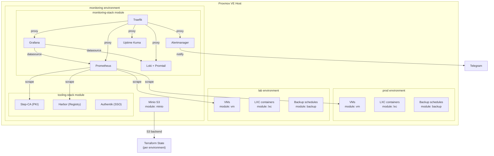
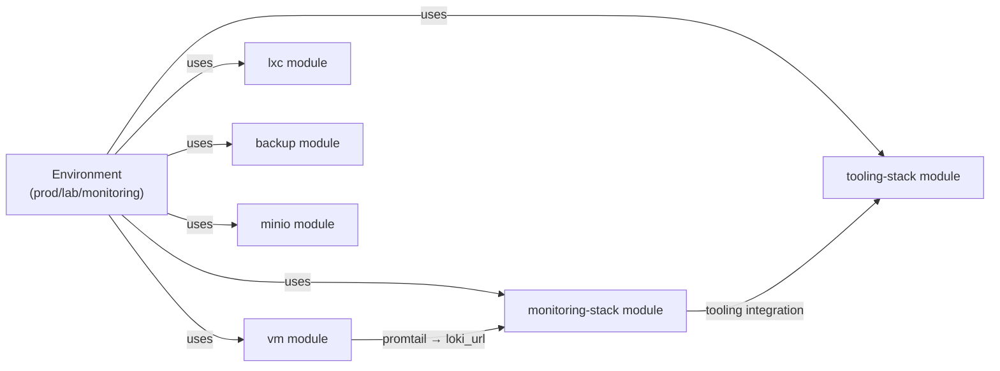
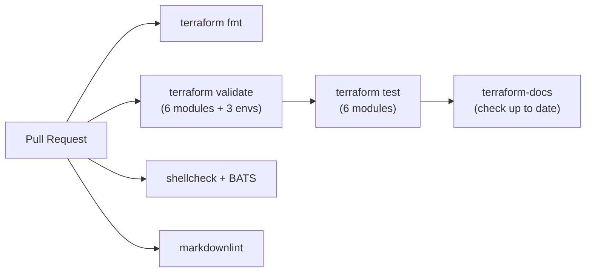

# Architecture

## Overview

PVE-Home is an Infrastructure as Code (IaC) project for managing a Proxmox VE homelab. It uses Terraform with the `bpg/proxmox` provider to declaratively manage VMs, LXC containers, backups, and a full monitoring/tooling stack.

## High-Level Architecture



## Terraform Modules

| Module | Purpose | Key Files |
|--------|---------|-----------|
| `vm` | Generic VM with cloud-init, Docker, Promtail | `main.tf`, `files/promtail-agent.yml.tpl` |
| `lxc` | LXC containers with networking | `main.tf` |
| `backup` | Vzdump backup schedules | `main.tf` |
| `minio` | S3-compatible storage for tfstate | `main.tf` |
| `monitoring-stack` | Full observability stack on a single VM | `main.tf`, `prometheus.tf`, `grafana.tf`, `alertmanager.tf`, `traefik.tf`, `loki.tf` |
| `tooling-stack` | PKI, registry, and SSO services | `main.tf` |

### Module Dependency Flow



## Environments

Each environment lives in `infrastructure/proxmox/environments/<name>/`:

| Environment | Purpose | Modules Used |
|-------------|---------|--------------|
| `prod` | Production workloads | vm, lxc, backup |
| `lab` | Development/testing | vm, lxc, backup |
| `monitoring` | Observability and tooling | monitoring-stack, minio, tooling-stack |

### Shared Variables

Environment configs share common variables via symlinks:

```
infrastructure/proxmox/
├── shared/
│   ├── common_variables.tf    # Provider config, node settings
│   └── env_variables.tf       # Per-environment variable definitions
└── environments/
    ├── prod/
    │   ├── common_variables.tf → ../../shared/common_variables.tf  (symlink)
    │   ├── env_variables.tf    → ../../shared/env_variables.tf     (symlink)
    │   ├── main.tf             # Module instantiations
    │   └── terraform.tfvars    # Environment-specific values
    ├── lab/
    │   └── ...                 (same symlink pattern)
    └── monitoring/
        └── ...                 (same symlink pattern)
```

## Key Patterns

### Cloud-Init Provisioning

VMs are provisioned via cloud-init with `templatefile()`:

1. Cloud-config YAML is generated from locals and uploaded as a Proxmox snippet
2. Shell scripts in `modules/*/files/*.sh.tpl` are rendered via `templatefile()`
3. The `runcmd` directive in cloud-config executes setup scripts on first boot

### Monitoring Integration

The `vm` module supports optional Promtail agent installation:
- When `install_promtail = true` and `loki_url` is set, VMs ship logs to Loki
- The monitoring-stack module outputs `loki_url` for consumption by other modules

### Backup Strategy

- **Vzdump**: Automated backups via the `backup` module (Proxmox native)
- **Terraform state**: Stored in Minio S3 buckets with versioning per environment
- **Verification**: `scripts/restore/verify-backups.sh` checks integrity of both

## CI/CD Pipeline



### Test Coverage

| Test Type | Count | Tool |
|-----------|-------|------|
| Terraform tests | ~420 | `terraform test` (native, per-module) |
| BATS tests | ~870 | `bats --recursive tests/` |
| Shellcheck | all `.sh` and `.sh.tpl` | `shellcheck -x -S warning` |

## Scripts

Operational scripts in `scripts/` provide day-to-day management:

| Script | Purpose |
|--------|---------|
| `health/check-health.sh` | Infrastructure health checks with Prometheus metrics |
| `restore/restore-vm.sh` | Restore VM/LXC from vzdump backup |
| `restore/verify-backups.sh` | Verify backup integrity (vzdump + Minio) |
| `restore/restore-tfstate.sh` | Restore Terraform state from Minio |
| `lib/common.sh` | Shared library (logging, SSH, parsing) |

All scripts source `scripts/lib/common.sh` for consistent logging, SSH utilities, and dry-run support.
